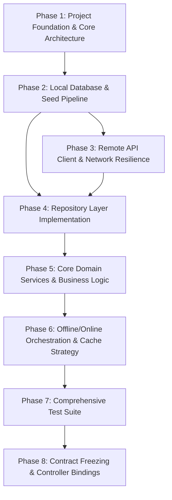

# RituRasa — Comprehensive Local Backend Build Plan & Phased Tasklist
## Scope: Flutter Local Backend + SimpleNutriAPI Integration

**Status:** Approved for Implementation  
**Architecture:** Offline-First Clean Architecture with Dual SQLite Databases  
**Authoritative Reference Knowledge:** SimpleNutriAPI (`nutrition_reference.db` pre-compiled bundle)  
**Authoritative User State:** Flutter Local App Database (`riturasa_user.db`)  

---

## 1. System Architecture & Boundaries

```text
┌──────────────────────────────────────────────────────────────────────────────────┐
│                             Flutter Presentation / UI                            │
│                  (Pure consumer — ZERO direct HTTP or SQLite calls)              │
└─────────────────────────────────────────┬────────────────────────────────────────┘
                                          │
                                          ▼
┌──────────────────────────────────────────────────────────────────────────────────┐
│                   Application Layer / Riverpod Controllers                       │
│    ProfileController │ CycleController │ KitchenController │ IntakeController    │
│    ShoppingController │ RecommendationController                                 │
└─────────────────────────────────────────┬────────────────────────────────────────┘
                                          │
                                          ▼
┌──────────────────────────────────────────────────────────────────────────────────┐
│                              Domain Service Layer                                │
│   CycleService         │ KitchenMatchingService │ NutritionProgressService       │
│   ShoppingService      │ RecommendationEngine   │ SyncService                    │
└─────────────────────────────────────────┬────────────────────────────────────────┘
                                          │
                                          ▼
┌──────────────────────────────────────────────────────────────────────────────────┐
│                             Domain Repository Layer                              │
│   ProfileRepo │ CycleRepo │ KitchenRepo │ IntakeRepo │ ShoppingRepo │ Food/Recipe│
└────────────────────────────────────┬────────────────────────────┬────────────────┘
                                     │                            │
                                     ▼                            ▼
┌──────────────────────────────────────────────┐  ┌────────────────────────────────┐
│             Local Data Source                │  │       Remote Data Source       │
│  ┌────────────────────┐ ┌──────────────────┐ │  │  ┌───────────────────────────┐  │
│  │ nutrition_ref.db   │ │ riturasa_user.db │ │  │  │   SimpleNutriApiClient    │  │
│  │ (Bundled SQLite,   │ │ (User Profile,   │ │  │  │   (Dio, Interceptors,     │  │
│  │  Foods, Nutrients, │ │  Cycle History,  │ │  │  │    Retry, DTO Mappers)    │  │
│  │  Recipes, FTS5)    │ │  Kitchen, Intake,│ │  │  └─────────────┬─────────────┘  │
│  │  [Read-Only/Sync]  │ │  Shopping, Favs) │ │  └────────────────┼────────────────┘
│  └────────────────────┘ └──────────────────┘ │                   │
└──────────────────────────────────────────────┘                   ▼
                                                      SimpleNutriAPI (FastAPI)
```

### 1.1 Dual SQLite Database Architecture
To guarantee absolute user data integrity and zero corruption during reference data refreshes:
1. **`nutrition_reference.db`**:
   - Seeded from `SimpleNutriAPI/mobile_bundle/nutrition.db` (3.5MB).
   - Contains: `foods`, `nutrients`, `food_nutrients`, `recipes`, `recipe_ingredients`, `food_aliases`, `categories`, `cuisines`, `regions`, `countries`, `diet_types`, `sources`, and `foods_fts` (SQLite FTS5 full-text search).
   - Read-only during standard app runtime. Updated atomically during reference dataset migrations.
2. **`riturasa_user.db`**:
   - Stores user-owned private data.
   - Contains: `user_profile`, `user_preferences`, `cycle_history`, `kitchen_inventory`, `daily_intake`, `daily_nutrient_totals`, `shopping_list`, `favorites`, `sync_metadata`.
   - Never modified, truncated, or overwritten by remote reference syncs.

---

## 2. Granular Tasklist & Implementation Phases



---

### Phase 1: Project Foundation & Core Architecture
*Goal: Initialize Flutter project, establish directory structure, core failure models, dependency injection, and configuration.*

- [ ] **TASK-1.1: Flutter Project Initialization & Dependencies**
  - Initialize Flutter project with bundle identifier `com.riturasa.app`.
  - Configure `pubspec.yaml` with:
    - `flutter_riverpod: ^2.5.1`
    - `sqflite: ^2.3.3`
    - `sqflite_common_ffi: ^2.3.3` (for headless unit/integration test execution)
    - `path: ^1.9.0`
    - `path_provider: ^2.1.2`
    - `dio: ^5.4.1`
    - `equatable: ^2.0.5`
    - `uuid: ^4.3.3`
    - `shared_preferences: ^2.2.2`
    - `intl: ^0.19.0`
  - Dev dependencies: `flutter_test`, `mocktail: ^1.0.3`, `build_runner`.
- [ ] **TASK-1.2: Architecture Directory Structure**
  - Scaffold directories:
    - `lib/core/{errors,network,database,config,utils,constants,di}/`
    - `lib/data/{local/{database,dao},remote/{api,dto,mappers},repositories}/`
    - `lib/domain/{models,services,repositories}/`
    - `lib/features/{profile,cycle,nutrition,kitchen,recipes,intake,shopping}/`
    - `test/{unit,data,integration}/`
- [ ] **TASK-1.3: Core Failure & Result Abstractions**
  - `lib/core/errors/failure.dart`: Sealed class hierarchy (`NetworkFailure`, `ApiTimeoutFailure`, `ApiResponseFailure`, `DatabaseFailure`, `NotFoundFailure`, `CycleCalculationFailure`, `SyncFailure`).
  - `lib/core/utils/result.dart`: Functional `Result<T, Failure>` with `onSuccess`, `onFailure`, `fold`, `isSuccess`, `isFailure`.
- [ ] **TASK-1.4: App Configuration & Environment**
  - `lib/core/config/app_config.dart`: SimpleNutriAPI base URL (`http://127.0.0.1:8000` or production host), timeouts (connect: 5s, receive: 8s), database file names and versions.

---

### Phase 2: Local Database & Seed Pipeline (Dual SQLite Engine)
*Goal: Establish database connection managers, asset extraction for `nutrition.db`, and schema migrations for user state.*

- [ ] **TASK-2.1: Reference Database Asset Bundling**
  - Copy `SimpleNutriAPI/mobile_bundle/nutrition.db` to `assets/database/nutrition_reference.db`.
  - Declare asset in `pubspec.yaml`.
- [ ] **TASK-2.2: Dual Database Connection Manager**
  - `lib/core/database/database_manager.dart`:
    - Handles first-run extraction of `nutrition_reference.db` to app documents directory.
    - Manages version checks for updating the reference database.
    - Manages initialization and connection lifecycle of `riturasa_user.db`.
- [ ] **TASK-2.3: User Database Schema & Migration Engine**
  - `lib/data/local/database/user_database_schema.dart`:
    - Table DDLs: `user_profile`, `user_preferences`, `cycle_history`, `kitchen_inventory`, `daily_intake`, `daily_nutrient_totals`, `shopping_list`, `favorites`, `sync_metadata`.
    - Versioned migration executor (`onUpgrade`) preserving user records across versions.
- [ ] **TASK-2.4: Reference Database DAOs**
  - `lib/data/local/dao/food_dao.dart`: FTS5 full-text search (`foods_fts`), `getById`, `getByCategory`, `getByTags`, `getFoodNutrients`.
  - `lib/data/local/dao/recipe_dao.dart`: `getAllRecipes`, `getById`, `getIngredients`, `searchByTagsAndCuisine`.
  - `lib/data/local/dao/taxonomy_dao.dart`: `getCategories`, `getCuisines`, `getRegions`, `getDietTypes`.
- [ ] **TASK-2.5: User State DAOs**
  - `lib/data/local/dao/profile_dao.dart`: `getProfile`, `upsertProfile`, `updatePreferences`.
  - `lib/data/local/dao/cycle_dao.dart`: `getCycleLogs`, `getLatestCycleLog`, `insertCycleLog`, `deleteCycleLog`.
  - `lib/data/local/dao/kitchen_dao.dart`: `getInventory`, `addOrUpdateItem`, `removeItem`, `clearInventory`.
  - `lib/data/local/dao/intake_dao.dart`: `logIntake`, `getIntakesForDate`, `deleteIntake`, `getDateRangeIntakes`.
  - `lib/data/local/dao/shopping_dao.dart`: `getShoppingList`, `upsertItem`, `toggleChecked`, `removeChecked`, `clearAll`.
  - `lib/data/local/dao/sync_metadata_dao.dart`: `getMetadata`, `setMetadata`.

---

### Phase 3: Remote API Client & Network Resilience (SimpleNutriAPI)
*Goal: Implement a typed HTTP client matching SimpleNutriAPI endpoints with robust error mapping and retries.*

- [ ] **TASK-3.1: Dio HTTP Client & Resilient Interceptors**
  - `lib/data/remote/api/api_client.dart`:
    - Timeout configurations (5000ms connect, 8000ms receive).
    - Logging interceptor.
    - Retry interceptor for network blips (exponential backoff, 2 retries on idempotent GETs).
    - Error mapping interceptor converting Dio exceptions into `NetworkFailure`, `ApiTimeoutFailure`, `ApiResponseFailure`.
- [ ] **TASK-3.2: Remote DTOs (Data Transfer Objects)**
  - `lib/data/remote/dto/food_dto.dart`: `FoodDto`, `FoodNutrientDto`, `FoodRecommendationRequestDto`, `FoodRecommendationResponseDto`.
  - `lib/data/remote/dto/recipe_dto.dart`: `RecipeDto`, `RecipeIngredientDto`, `RecipeRankingRequestDto`, `RankedRecipeDto`.
  - `lib/data/remote/dto/cycle_dto.dart`: `CycleEstimateRequestDto`, `CyclePhaseResponseDto`.
  - `lib/data/remote/dto/shopping_dto.dart`: `ShoppingListRequestDto`, `ShoppingListResponseDto`.
  - `lib/data/remote/dto/health_dto.dart`: `HealthCheckDto`, `DatasetVersionDto`.
- [ ] **TASK-3.3: DTO Mappers to Pure Domain Models**
  - `lib/data/remote/mappers/food_mapper.dart`: `FoodDto` -> `FoodItem`.
  - `lib/data/remote/mappers/recipe_mapper.dart`: `RecipeDto` / `RankedRecipeDto` -> `RecipeItem`.
  - `lib/data/remote/mappers/cycle_mapper.dart`: `CyclePhaseResponseDto` -> `CyclePhaseInfo`.
  - `lib/data/remote/mappers/shopping_mapper.dart`: `ShoppingListResponseDto` -> `ShoppingListItem`.
- [ ] **TASK-3.4: SimpleNutriApiService Contract Implementation**
  - `lib/data/remote/api/simple_nutri_api_service.dart`:
    - `fetchHealth()`, `fetchDatasetVersion()`
    - `fetchFoods()`, `searchFoods(query, category)`
    - `fetchRecipes()`, `getRecipeById(id)`
    - `estimateCyclePhase(request)`
    - `rankRecipes(request)`
    - `rankFoods(request)`
    - `generateShoppingList(request)`

---

### Phase 4: Domain Models & Repository Layer
*Goal: Implement clean, immutable domain models and repositories encapsulating local caching and remote fallback.*

- [ ] **TASK-4.1: Pure Domain Entity Definitions**
  - `lib/domain/models/user_profile.dart`: `UserProfile`, `UserPreferences`, `DietType`.
  - `lib/domain/models/cycle.dart`: `CycleRecord`, `CyclePhaseInfo`, `CycleDayState`.
  - `lib/domain/models/food.dart`: `FoodItem`, `NutrientAmount`, `FoodCategory`.
  - `lib/domain/models/recipe.dart`: `RecipeItem`, `RecipeIngredient`, `RecipeNutrientSummary`.
  - `lib/domain/models/kitchen_item.dart`: `KitchenItem`.
  - `lib/domain/models/intake_entry.dart`: `IntakeEntry`, `MealType`.
  - `lib/domain/models/nutrient_totals.dart`: `DailyNutrientTotals`, `NutrientProgress`, `RdaTarget`.
  - `lib/domain/models/shopping_item.dart`: `ShoppingListItem`.
  - `lib/domain/models/recommendation.dart`: `RecommendationResult`, `RankedRecipeItem`, `RankedFoodItem`.
- [ ] **TASK-4.2: Repository Interfaces**
  - `lib/domain/repositories/i_profile_repository.dart`
  - `lib/domain/repositories/i_cycle_repository.dart`
  - `lib/domain/repositories/i_food_repository.dart`
  - `lib/domain/repositories/i_recipe_repository.dart`
  - `lib/domain/repositories/i_kitchen_repository.dart`
  - `lib/domain/repositories/i_intake_repository.dart`
  - `lib/domain/repositories/i_shopping_repository.dart`
  - `lib/domain/repositories/i_sync_repository.dart`
- [ ] **TASK-4.3: Repository Concrete Implementations**
  - `lib/data/repositories/profile_repository_impl.dart`: Local CRUD via `ProfileDao`.
  - `lib/data/repositories/cycle_repository_impl.dart`: Period tracking via `CycleDao`.
  - `lib/data/repositories/food_repository_impl.dart`: FTS5 local search; remote fallback on zero matches if online.
  - `lib/data/repositories/recipe_repository_impl.dart`: Queries local `RecipeDao`; fetches remote recipe details when needed.
  - `lib/data/repositories/kitchen_repository_impl.dart`: CRUD on `KitchenDao` joined with `FoodItem` reference data.
  - `lib/data/repositories/intake_repository_impl.dart`: Logging foods and recipes to `IntakeDao`.
  - `lib/data/repositories/shopping_repository_impl.dart`: CRUD and checked-state management in `ShoppingDao`.
  - `lib/data/repositories/sync_repository_impl.dart`: Version checking and reference data synchronization.

---

### Phase 5: Core Domain Services & Business Logic
*Goal: Build 100% testable, standalone local business logic services that operate completely offline.*

- [ ] **TASK-5.1: CycleService (100% Local Calculation)**
  - `lib/domain/services/cycle_service.dart`:
    - Calculate current cycle day given `lastPeriodStart` and target date.
    - Support variable and typical cycle lengths (default: 28 days).
    - Phase partition logic:
      - Days 1-5: Menstrual (Focus: Iron, Vitamin C, Magnesium, Anti-inflammatory).
      - Days 6-13: Follicular (Focus: Protein, Folate, Zinc, B-vitamins).
      - Days 14-16: Ovulatory (Focus: Fiber, Zinc, Antioxidants, Potassium).
      - Days 17-28+: Luteal (Focus: Magnesium, Calcium, Vitamin B6, Complex Carbs).
    - Predict next period date and days remaining with estimation confidence metadata.
- [ ] **TASK-5.2: KitchenMatchingService (Local Recipe Scoring Engine)**
  - `lib/domain/services/kitchen_matching_service.dart`:
    - Compare kitchen inventory `food_id` set against recipe ingredients.
    - Compute availability match percentage: `matchedCount / totalIngredients * 100`.
    - Calculate nutritional alignment score based on phase target tags.
    - Generate missing ingredients list with quantities and standard units.
    - Composite formula: `(matchPct * 0.6) + (tagOverlap * 8.0) - (missingCount * 5.0)`.
- [ ] **TASK-5.3: NutritionProgressService & RDA Engine**
  - `lib/domain/services/nutrition_progress_service.dart`:
    - Bundled authoritative ICMR-NIN 2024 / USDA reference values for adult women.
    - Compute aggregated daily totals from `List<IntakeEntry>` for 14 tracked nutrients:
      - Energy (kcal), Protein (g), Carbohydrates (g), Fat (g), Fiber (g), Iron (mg), Calcium (mg), Magnesium (mg), Zinc (mg), Potassium (mg), Sodium (mg), Vitamin C (mg), Folate (µg), Vitamin B6 (mg).
    - Calculate percentage fulfillment per nutrient (`consumed / target * 100`).
    - Produce typed `DailyProgressSummary` with status indicators (Under, Optimal, Exceeded).
- [ ] **TASK-5.4: ShoppingService (Missing Ingredient Deduplication Engine)**
  - `lib/domain/services/shopping_service.dart`:
    - Compare one or more selected recipes against current kitchen inventory.
    - Identify missing items; deduplicate by canonical `food_id`.
    - Aggregate required quantities across recipes with unit normalization (g, ml, pcs).
    - Merge into active shopping list without duplicate rows.
- [ ] **TASK-5.5: RecommendationEngine (Orchestration Service)**
  - `lib/domain/services/recommendation_engine.dart`:
    - Orchestrates Profile + Cycle + Kitchen + Food/Recipe data.
    - Offline Path: Executes local scoring via `KitchenMatchingService` and local food tag matching.
    - Online Path: If connected and remote enrichment is enabled, queries `/api/v1/recommendations/recipes` and `/api/v1/recommendations/foods`, falling back transparently to local scoring if remote call fails or times out.

---

### Phase 6: Offline/Online Orchestration & Cache Strategy
*Goal: Implement synchronization rules, fallback semantics, and dataset version verification.*

- [ ] **TASK-6.1: Connectivity Observer & Network Status Provider**
  - `lib/core/network/network_info.dart`: Reachability detection and reactive stream.
- [ ] **TASK-6.2: Offline-First Fallback Orchestrator**
  - `lib/data/repositories/orchestration_helper.dart`:
    - Cache-First / Local-First wrapper:
      - If local data is sufficient -> return immediately.
      - If remote request needed and offline -> return local result or typed `OfflineDataUnavailableFailure`.
      - If remote request succeeds -> write through to local cache -> return mapped domain model.
- [ ] **TASK-6.3: Reference Data Versioning & Non-Destructive Sync**
  - `lib/domain/services/sync_service.dart`:
    - Compares `source_version` against local `sync_metadata`.
    - If newer reference data is available, downloads updated dataset or delta, updates `nutrition_reference.db` tables inside an atomic transaction.
    - Never touches or modifies `riturasa_user.db`.

---

### Phase 7: Comprehensive Test Suite
*Goal: Automated verification across unit, DAO, repository, and end-to-end integration flows without rendering UI.*

- [ ] **TASK-7.1: Pure Unit Tests**
  - `test/unit/services/cycle_service_test.dart`: Cycle day & phase calculations, irregular lengths, leap year boundary tests.
  - `test/unit/services/nutrition_progress_service_test.dart`: Nutrient aggregation, ICMR-NIN RDA target percentages, zero target safeguards.
  - `test/unit/services/kitchen_matching_service_test.dart`: Recipe availability scoring, tag overlap, missing ingredient calculations.
  - `test/unit/services/shopping_service_test.dart`: Missing ingredient deduplication and quantity aggregation.
- [ ] **TASK-7.2: Database & DAO Unit Tests**
  - Using `sqflite_common_ffi` headless test runner:
    - `test/data/local/food_dao_test.dart`: FTS5 queries for "ragi", "spinach", aliases.
    - `test/data/local/user_database_test.dart`: Profile, intake, kitchen, and cycle CRUD.
    - Database migration runner tests.
- [ ] **TASK-7.3: Remote API & Mapper Tests**
  - `test/data/remote/dto_mappers_test.dart`: JSON fixtures verification.
  - `test/data/remote/api_client_test.dart`: Timeout handling, retry policies, failure mapping.
- [ ] **TASK-7.4: End-to-End Offline Integration Test (Flow A)**
  - `test/integration/offline_flow_test.dart`:
    1. Initialize database with seed data.
    2. Create user profile (age 26, vegetarian, South Indian).
    3. Log last period date (Cycle Day 8 -> Follicular Phase).
    4. Add kitchen ingredients (`ragi`, `rice`, `urad_dal`).
    5. Run recommendation engine -> verify top recipe matches follicular priorities.
    6. Select and log recipe into `daily_intake`.
    7. Calculate daily nutrient totals -> verify iron, protein, calcium progress.
    8. Trigger missing ingredients calculation -> verify deduplicated shopping list items.
- [ ] **TASK-7.5: Resilient Online Fallback Integration Test (Flow B & C)**
  - `test/integration/resilient_fallback_test.dart`: Simulate API timeout/network failure; verify local backend delivers recommendations without crashing.

---

### Phase 8: State Management & Presentation Controller Bindings
*Goal: Expose clean Riverpod StateNotifiers / AsyncNotifiers for future UI widgets.*

- [ ] **TASK-8.1: Dependency Injection Providers**
  - `lib/core/di/dependency_providers.dart`: Riverpod providers for databases, DAOs, repositories, and domain services.
- [ ] **TASK-8.2: Feature Controllers**
  - `lib/features/profile/profile_controller.dart`: StateNotifier for user profile & dietary preferences.
  - `lib/features/cycle/cycle_controller.dart`: StateNotifier for period logging, cycle day, and active phase.
  - `lib/features/kitchen/kitchen_controller.dart`: StateNotifier for kitchen pantry CRUD and autocomplete search.
  - `lib/features/intake/intake_controller.dart`: StateNotifier for logging meals and real-time RDA progress.
  - `lib/features/shopping/shopping_controller.dart`: StateNotifier for active shopping checklist.
  - `lib/features/nutrition/recommendation_controller.dart`: AsyncNotifier providing "What Should I Eat?" results.
- [ ] **TASK-8.3: Project Documentation & Backend Contract Freeze**
  - Document complete API surface in `BACKEND_CONTRACT.md`.
  - Validate clean `flutter analyze` and 100% passing tests.

---

## 3. Definition of Done (Verification Checklist)

- [ ] App starts entirely from local data without network connection.
- [ ] Local database (`riturasa_user.db`) initializes and migrates safely.
- [ ] SimpleNutriAPI is queried through dedicated client (`SimpleNutriApiClient`).
- [ ] API DTOs never leak directly into UI or domain layer.
- [ ] User profile persists locally.
- [ ] Cycle history persists locally; current cycle & phase are calculated 100% locally.
- [ ] Nutrition focus resolves locally.
- [ ] Kitchen inventory works 100% offline.
- [ ] Recipes and recipe nutrition per serving work 100% offline.
- [ ] Food & recipe recommendations work with local inventory data.
- [ ] Daily intake logging works 100% offline.
- [ ] Daily nutrient totals and ICMR-NIN RDA progress calculate 100% locally.
- [ ] Shopping list and missing ingredients work 100% offline.
- [ ] API failure does not cause any crash or degraded local experience.
- [ ] User data is preserved during reference database updates.
- [ ] All unit and integration test suites pass via `flutter test`.
- [ ] UI can consume the backend entirely through typed controllers.
